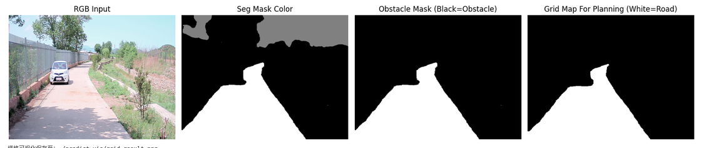
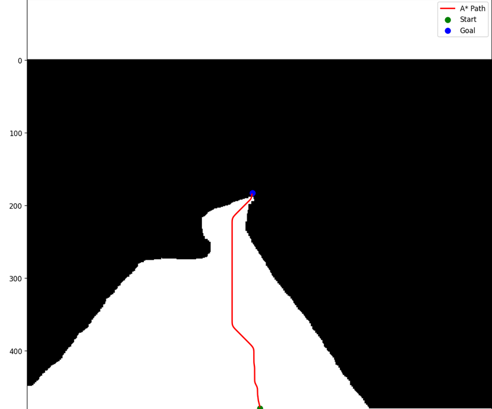

## 项目简介

基于 [ORFD](https://github.com/chaytonmin/ORAD-3D-Dataset-For-Off-Road-AD) 越野路面数据集，使用 [SMP](https://github.com/qubvel-org/segmentation_models.pytorch)（Segmentation Models PyTorch）完成地表语义分割，将分割预测结果转换为栅格占用地图，通过 A\* FindPath 算法实现越野场景自主路径规划。

## 环境依赖
核心依赖：

- pytorch
- segmentation-models-pytorch
- opencv-python
- numpy
- matplotlib

## 运行流程

1. 使用训练好的 ORFD 分割模型对路面图像推理，输出分割掩码
2. 将多类别分割掩码二值化为可通行 / 障碍物栅格地图
3. 载入栅格地图，调用 FindPath（A\*）算法生成最优行驶路径
4. 可视化分割图与规划路径结果

## 模型说明

训练权重文件`.ckpt`体积较大，不存入仓库，可自行训练或网盘下载模型放入本地`weights/`文件夹。

## 安装第三方库 SMP

文件夹下载或者，直接 pip 安装：

```
pip install segmentation-models-pytorch
```
## 安装第三方库 pathfinding 

无需存放源码文件夹，直接 pip 安装：
```
pip install pathfinding -i https://pypi.tuna.tsinghua.edu.cn/simple
```

## 使用方法

1. 使用数据集ORDF，使用train.ipynb训练模型，本项目选用LinkNet作为基础网络架构，编码器（Encoder）采用 ResNet18，
借助 SMP 库快速搭建轻量化语义分割模型，适配越野路面实时推理需求。
2. 将模型权重放置本地 weights 目录
3. 运行 SMP调用.ipynb 进行模型调用完成图像的语义分割和findpath设置好起点终点进行寻找路径


## 实验效果展示
<div align="center">

</div>
<center>输入路面图像 | 语义分割结果 | 栅格化</center>

## 动态演示视频
完整语义分割运行演示：
https://github.com/user-attachments/output.mp4

## 路径规划展示
<div align="center">

</div>
<center>A*基于格栅图路径规划，并且做一维高斯平滑，消除锯齿拐点，输出平滑轨迹坐标</center>
